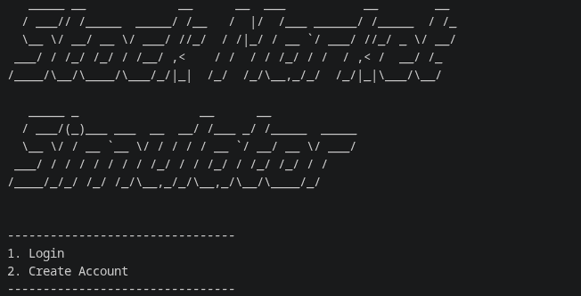
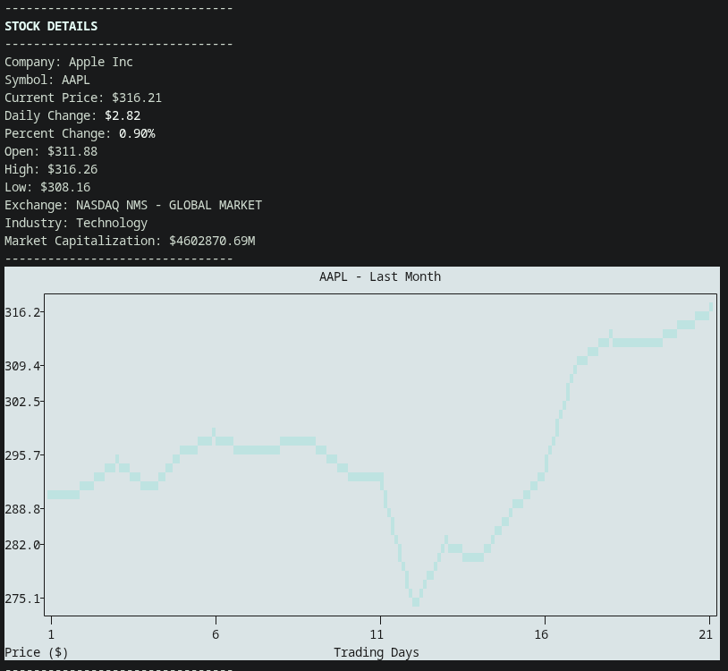

# Stock Market Simulator

This is a local stock market simulator made using Python and SQLite. The simulator uses live stock market data and lets users buy and sell stocks through virtual money.

## Features
* User creation and login
* Password hashing before storing passwords
* Live stock prices using the Finnhub API
* Company information (market cap, industry, exchange, open/high/low)
* Historical stock graphs using Yahoo Finance
* Buying and selling stocks
* Portfolio management
* Net worth calculation
* Transaction history with timestamps
* Input validation and error handling
* Colored terminal interface

## Modules Used

* sqlite3
* hashlib
* requests
* python-dotenv
* pyFiglet
* plotext
* yfinance

## Database Structure

The project contains four tables.

* users
* stocks
* portfolio
* transactions

### Available Stocks

Currently, there are 9 stocks available for trading.

| Symbol |
| ------ |
| AAPL |
| TSLA |
| NVDA |
| MSFT |
| GOOGL |
| AMZN |
| META |
| AMD |
| INTC |

## Transactions

Every transaction stores:

* Stock symbol
* Buy/Sell type
* Share quantity
* Trade price
* Total value
* Timestamp

## 📦 Linux Release

A Linux executable **Linux (x86_64)** is available in the release section.

```bash
./Main
```

- The sim stores its data in a local SQLite database (`stock_sim.db`)

## Running from Source
### Requirements

* requests
* python-dotenv
* pyfiglet
* plotext
* yfinance

### Installation
Clone the repository.

```bash
git clone https://github.com/Eraxty/Stock-Market-Simulator.git
cd Stock-Market-Simulator
```

Create a virtual environment.

```bash
python -m venv .venv
```

Activate it.

```bash
source .venv/bin/activate
```

For Fish shell:

```bash
source .venv/bin/activate.fish
```

Install the required packages.

```bash
pip install -r requirements.txt
```

Run the program.

```bash
python Main.py
```

## Workflow

1. Create an account
2. Log in
3. Browse live stock prices
4. View company information and graphs
5. Buy stocks
6. Track your portfolio and net worth
7. View transaction history
8. Sell stocks

## Future Improvements

* Profit/Loss tracking
* Watchlist
* Search stocks
* GUI version

## Screenshots

### Home Screen


### Login Screen


### Main Menu


### Stock info



-Built as a Python and SQLite learning project.