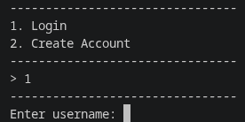
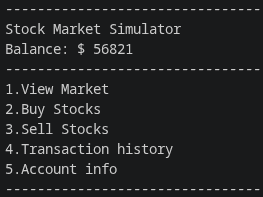

# Stock Market Simulator
This is a local stock market simulator made using python and SQLite.

## Features

* User creation and Login
* Password hashing before storing passwords in db
* Buying and selling stocks
* Transaction history 
* stock market with changing prices

## Modules Used

* SQLite3
* Hashlib
* Random
* Time

## Database Structure
it contains 4 tables 

* portfolio
* stocks 
* transactions 
* users


### Available Stocks
Currently, there are 10 stocks available for trading.

| ID | Symbol |
| -- | ------ |
| 1  | AAPL   |
| 2  | NASDAQ |
| 3  | TSLA   |
| 4  | NVDA   |
| 5  | MSFT   |
| 6  | GOOGL  |
| 7  | AMZN   |
| 8  | META   |
| 9  | AMD    |
| 10 | INTC   |


### Transactions
All the buy and sell history is tracked in transactions table in the db.

## How It Works
The market updates every 30 seconds. Each stock price is modified by a randomly selected market event, such as:

* Crash
* Boom
* Bear Market
* Bull Market
* Stable Market
* Small Increase
* Small Decrease

Different events have different Weights (probability)

## Platform Support

This release was built and tested on **Linux (Arch Linux x86_64)** using PyInstaller.

The executable included in the GitHub Release is intended for Linux systems. Users on Windows or mac should run the project from source using python.

### Running from Source

```bash
python Main.py
```

### GitHub Release

Download the latest release from the Releases page.

## Workflow

1. Create an account
2. Log in
3. View available stocks
4. Buy shares
5. View transaction history
6. Sell shares
7. Track portfolio and account balance
8. Make as much money as possible

## Future Improvements

* Portfolio value calculation
* Net worth tracking
* Improved transaction history display
* Better input validation
* GUI
## Screenshots 
### Login Screen



### Main Menu



## -
Built as a Python and SQLite learning project.
